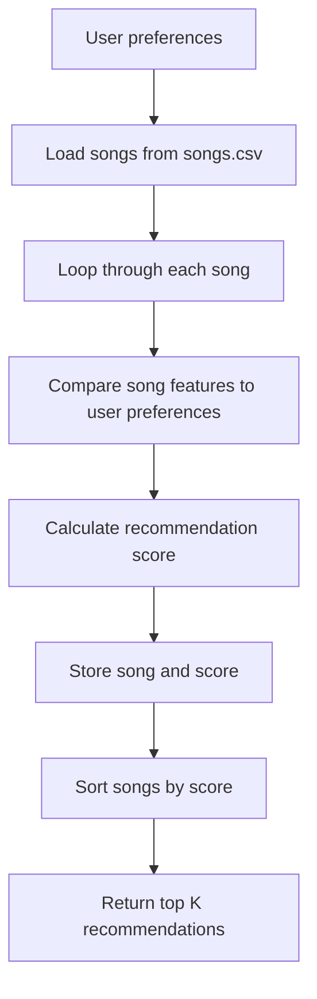
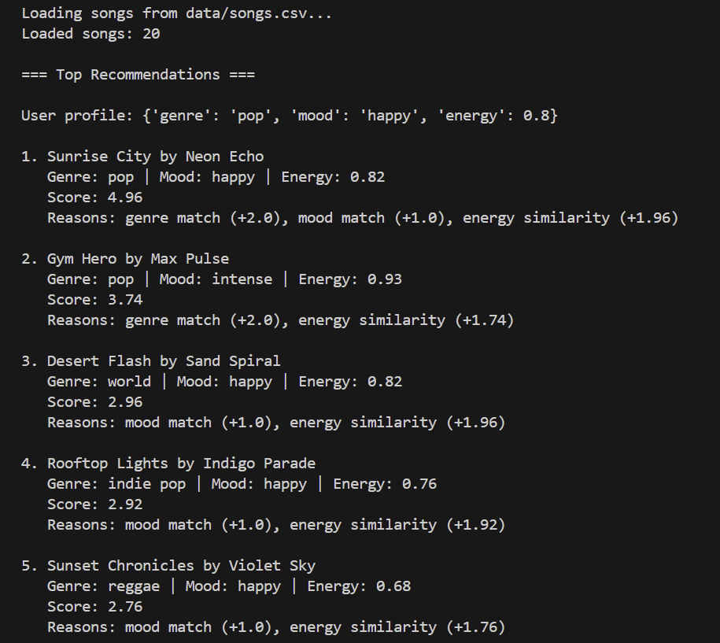
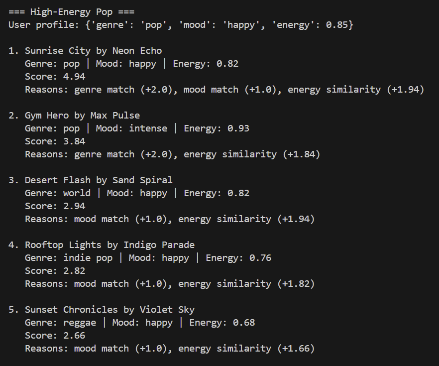
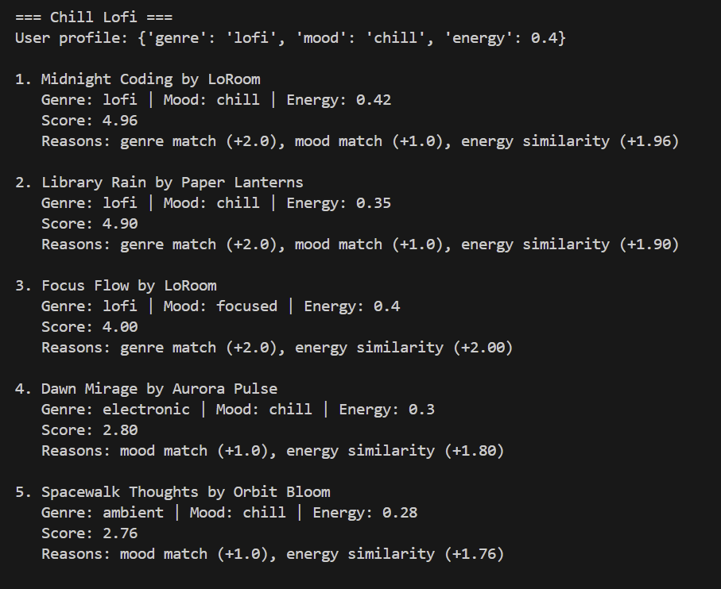
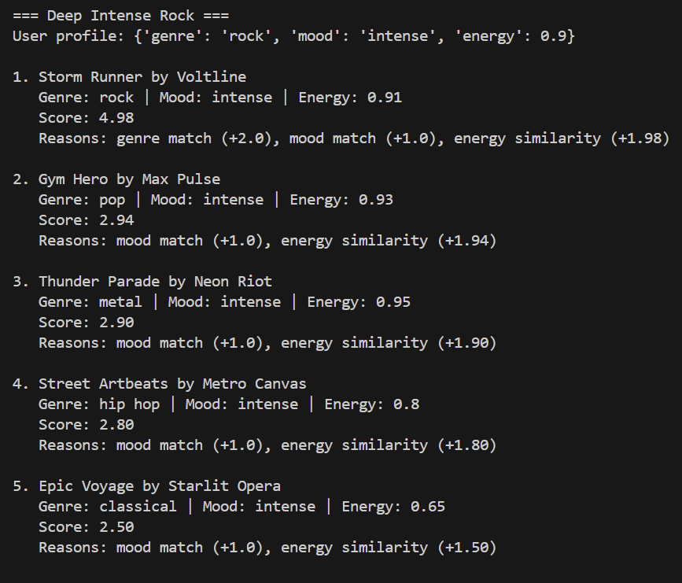
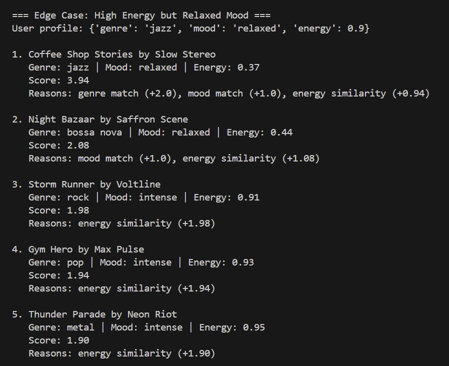

# 🎵 Music Recommender Simulation

## Project Summary

In this project you will build and explain a small music recommender system.

Your goal is to:

- Represent songs and a user "taste profile" as data
- Design a scoring rule that turns that data into recommendations
- Evaluate what your system gets right and wrong
- Reflect on how this mirrors real world AI recommenders

Replace this paragraph with your own summary of what your version does.

---
My system creates song recommendations by comparing several factors such as genre, energy, tempo, etc from the song with the user's existing profile. 

## How The System Works

Explain your design in plain language.

Some prompts to answer:

- What features does each `Song` use in your system
  - For example: genre, mood, energy, tempo
- What information does your `UserProfile` store
- How does your `Recommender` compute a score for each song
- How do you choose which songs to recommend

You can include a simple diagram or bullet list if helpful.

---
Each Song includes features like genre, mood, energy, tempo, valence, danceability, and acousticness. All the features are important. For example, genre tells us about the style and mood tells us about the feeling. And the other features tells us more about specifics about the song like tempo and danceability. The UserProfile should tell you what does our listener prefer. They should includes all the factors that songs.csv mention. However, I think genre and mood should be the most important information. The Recommender should give a score for each song by comparing the songs features to the user's preferences. If the song matches the user's preferences for genre and mood, they should earn extra points. If they are farther away from the user's preferences, they should earn less points. The Recommender should reward points based on similaries to be more inligned with the User's preferences. The Recommender should also sort the songs from highest to lowest scores. The highest score songs should be choosen as recommendations because they match the closest to what the user would like. The flow should be look at the UserProfile preferences, compare the song with it and give a score, sort all the songs by score, and then recommend the top score songs to the User. 


Example of User Profile:
user_profile = {
    "favorite_genre": "lofi",
    "favorite_mood": "chill",
    "target_energy": 0.35,
    "target_tempo_bpm": 75,
    "target_valence": 0.60,
    "target_danceability": 0.55,
    "target_acousticness": 0.80
}

Because there is clear classification for the categories, it should be able to separate intense rock from chill lofi with all the filtering for example. 

Algorithm Recipe:
2.0 points if the song’s genre matches the user’s favorite genre. 1 points if the song’s mood matches the user’s favorite mood
There should be similar points for numeric features: energy, tempo_bpm, valence, danceability, and acousticness.

The closer the song is to the user’s target, the more points it gets.

Sample Recipe: 
```python
score = 0

if song.genre == user_profile["favorite_genre"]:
    score += 2.0

if song.mood == user_profile["favorite_mood"]:
    score += 1.0

score += (1 - abs(song.energy - user_profile["target_energy"])) * 1.5

score += max(
    0,
    1 - abs(song.tempo_bpm - user_profile["target_tempo_bpm"]) / 100
) * 1.0

score += (1 - abs(song.valence - user_profile["target_valence"])) * 1.0

score += (1 - abs(song.danceability - user_profile["target_danceability"])) * 1.0

score += (1 - abs(song.acousticness - user_profile["target_acousticness"])) * 1.0
```

Mermaid Diagram:



In conclusion, this system uses the user's listening behavior to recommend songs based on the features of each song to the specific user preference profile. Each song includes factors such as genre, mood, energy, tempo, valence, danceability, and acousticness. The recommender should loop through each song in songs.csv and give a score based on how close it matches the user's preferences. The songs with the highest scores will be ranks first and be at the top of the recommendation. 

There are some potential biases. The dataset is small, so there isn't a lot of variety. The system might be bias toware teh user's favorite genre even when other songs have similar moods or factors because it is weighted the most. It could ignore great songs that match the user's mood if it's not in the same genre.

## Getting Started

### Setup

1. Create a virtual environment (optional but recommended):

   ```bash
   python -m venv .venv
   source .venv/bin/activate      # Mac or Linux
   .venv\Scripts\activate         # Windows

2. Install dependencies

```bash
pip install -r requirements.txt
```

3. Run the app:

```bash
python -m src.main
```
After Implementing Phase 3: Implementation, these are the current results I receive



Stress Testing with Different Profiles:

High Energy Pop:


Chill Lofi:


Deep Intense Rock:


High Energy But Relaxed Mood:



### Running Tests

Run the starter tests with:

```bash
pytest
```

You can add more tests in `tests/test_recommender.py`.

---

## Experiments You Tried

Use this section to document the experiments you ran. For example:

- What happened when you changed the weight on genre from 2.0 to 0.5
- What happened when you added tempo or valence to the score
- How did your system behave for different types of users

---
I removed the mood feature from the scoring function. After doing this, the recommendations changed because the system started prioritizing songs with similar energy but very different emotional tones. For example, songs like Storm Runner and Gym Hero appeared in results for users who wanted a more relaxed or happy vibe, simply because their energy levels were similar. I also tested multiple user profiles, including High-Energy Pop, Chill Lofi, Deep Intense Rock, and an edge-case profile called high energy but relaxed mood. These tests showed that the system works well when preferences are clear, but struggles when features conflict or are mixed. Overall, I learned that mood is an important feature for capturing the emotional feel of music and the system became less accurate when mood was removed, which is what was expected. 

## Limitations and Risks

Summarize some limitations of your recommender.

Examples:

- It only works on a tiny catalog
- It does not understand lyrics or language
- It might over favor one genre or mood

You will go deeper on this in your model card.

---
This recommender a lot of limitations. It only uses a small dataset of 20 songs, which limits the diversity of recommendations. It also relies on a few features like genre, mood, and energy for example. It is not complex in considering whether or not the user likes a specific artist or specific lyrics. Another limitation is that the scoring system can overemphasize certain features, especially energy. This can cause songs with similar intensity to appear even when they do not match the user’s desired mood.The system may favor certain types of users while giving less accurate results for users with more mixed preferences.

## Reflection

Read and complete `model_card.md`:

[**Model Card**](model_card.md)

Write 1 to 2 paragraphs here about what you learned:

- about how recommenders turn data into predictions
- about where bias or unfairness could show up in systems like this

---
The student is trying to understand how the system creates song recommendations by comparing several factors such as genre, energy, tempo, etc from the song with the user's existing profile.The brainstorm in the beginning of the project was probably the biggest thing the student needs to work through to develop this system because they have to consider scoring and generate 10 more songs in songs.csv. Even with a basic algorithm, the system can produce recommendations that feel accurate when the right features are used. The dataset is really small and the sytem is open to biases. For example, if one feature like energy is weighted too heavily, the system may repeatedly recommend songs that match intensity but not the overall mood. The more complex or mixed a user's profile, the more likely they will be treated unfairly in this system. 


## 7. `model_card_template.md`

Combines reflection and model card framing from the Module 3 guidance. :contentReference[oaicite:2]{index=2}  

```markdown
# 🎧 Model Card - Music Recommender Simulation

## 1. Model Name

Give your recommender a name, for example:

> VibeFinder 1.0

---
My model name is VibeRecommenderSimulator

## 2. Intended Use

- What is this system trying to do
- Who is it for

Example:

> This model suggests 3 to 5 songs from a small catalog based on a user's preferred genre, mood, and energy level. It is for classroom exploration only, not for real users.

---
This recommender suggests songs based on what kind of music the user likes, such as their favorite genre, mood, and energy level. It assumes the user knows what type of vibe they want or like. This project is for classroom exploration.

## 3. How It Works (Short Explanation)

Describe your scoring logic in plain language.

- What features of each song does it consider
- What information about the user does it use
- How does it turn those into a number

Try to avoid code in this section, treat it like an explanation to a non programmer.

---
The features of each song are genre, mood, energy, tempo_bpm, valence, danceability, and acousticness. The model gives each song a score based on how well it matches the user’s preferences. If the genre or mood matches, the song gets extra points. It also checks how close the song’s energy, tempo_bpm, valence, danceability, and acousticness is to what the user wants. And the song also gets points based on this. Songs with higher scores are recommended first to the user. I determined the points based on all these factors from the starter logic and implemented it using Clause in recommender.py. 

## 4. Data

Describe your dataset.

- How many songs are in `data/songs.csv`
- Did you add or remove any songs
- What kinds of genres or moods are represented
- Whose taste does this data mostly reflect

---
The song.csv dataset contains 20 songs with features such as genre, mood, energy, tempo, valence, danceability, and acousticness. I expanded the dataset to include more genres like metal, reggae, classical, and bossa nova when I added 10 extra songs to the original 10. There are a lot of moods and genres represented like intense, chill, lofi, rock, and so on. The dataset is very small and does not fully represent all types of music or listening preferences.

## 5. Strengths

Where does your recommender work well

You can think about:
- Situations where the top results "felt right"
- Particular user profiles it served well
- Simplicity or transparency benefits

---
The system works well when the user has a clear preference, like chill lofi or intense rock. It does a good job matching songs with similar energy and genre. The results felt accurate based on what I was expecting. When I took out mood from the recommender.py, the results were less accurate, which shows that mood matters.

## 6. Limitations and Bias

Where does your recommender struggle

Some prompts:
- Does it ignore some genres or moods
- Does it treat all users as if they have the same taste shape
- Is it biased toward high energy or one genre by default
- How could this be unfair if used in a real product

---
The recommender only analyzes a few features like genre, mood, and energy. It could analyze more features like whether or not the user likes a specific artist or tempo. The songs.csv only had 20 songs, so it's a small sample size. There could be unrepresented genres and moods. So users with less common preferences would probably get weaker recommendations. The score can also proritize genre orenergy. For example, Gym Hero can rank high for users that want upbeat pop because it's high energy mood matches even if the mood doesn't fit. The system fices less accurate results to users with more mixed or unusual tastes. It would probably favor users with strong weighted features. 

## 7. Evaluation

How did you check your system

Examples:
- You tried multiple user profiles and wrote down whether the results matched your expectations
- You compared your simulation to what a real app like Spotify or YouTube tends to recommend
- You wrote tests for your scoring logic

You do not need a numeric metric, but if you used one, explain what it measures.

---
I tested the system with differnt profiles like High_Energy, Chill LoFi, Deep Intense Rock, and high energy with relaxed mood for an edge case. I checked whether the recommendations felt right based on the type of music each user would probably want. The results mostly matched what I was expecting.  But some high-energy songs kept appearing even when the mood was not the best match. This showed me that the recommender is bias to energy. I also compared the results before and after removing mood from the scoring, and the recommendations became less accurate, which helped confirm that mood is an important feature. Gym Hero keeps showing up because the system sees that its energy level is close to what the user wants, so it scores well even if its mood is not the best emotional match.

## 8. Future Work

If you had more time, how would you improve this recommender

Examples:

- Add support for multiple users and "group vibe" recommendations
- Balance diversity of songs instead of always picking the closest match
- Use more features, like tempo ranges or lyric themes

---
I want to expand the dataset to include more songs, more genres, more artists, more preferences, and so on. I also want to test with more user profiles and a variery of user profiles. I want to find more information on user profiles and different artist, genres, tempos, etc from Spotify. I want to improve the scoring system to balance out features and create better recommendations. Increasing the dataset would improve diversty among the top results as well as handle more complex user tastes, especially if I did research with Spotify or Apple Music. 

## 9. Personal Reflection

A few sentences about what you learned:

- What surprised you about how your system behaved
- How did building this change how you think about real music recommenders
- Where do you think human judgment still matters, even if the model seems "smart"

As I worked on this project, I learned how the recommender uses the songs.csv data to recommend songs to the user based on the user's profile by comparing features and assigning scores. I saw how small changes like removing mood from the recommender can make it less accurate. I was surprised that the system worked relatively okay though. This project changed how I think about real music recommenders. I now understand that they rely heavily on data and weighting, and that bias can easily appear if certain features are overemphasized. Music Recommenders that Apple Music or Spotify must be complex to consider many factors and many genres. Even if a system seems “smart,” human judgment is still important for understanding context, emotion, and nuance that a basic model cannot fully understand. I did need to double check the AI tools as I worked on this project. My biggest learning moment was seeing how the recommendations changes when factors were taken out. I would try to expand the datset if I had more time. 

## Reflect and Discuss
The summary should be 5–7 sentences covering:

- The core concept students needed to understand
- Where students are most likely to struggle
- Where AI was helpful vs misleading
- One way they would guide a student without giving the answer

The student is trying to understand how the system creates song recommendations by comparing several factors such as genre, energy, tempo, etc from the song with the user's existing profile.The brainstorm in the beginning of the project was probably the biggest thing the student needs to work through to develop this system because they have to consider scoring and generate 10 more songs in songs.csv. The students should remember to pip install -r requirements.txt. It is mentioned in the README.md, but it isn't mentioned in the lab. They might have issues running their code if everything isn't pip installed. Als this line needs to be changed from from "recommender import load_songs, recommend_songs" to "from src.recommender import load_songs, recommend_songs" because python -m src.main wasn't working without that change. The student may run into that issue. Other than that the lab was pretty straight forward. The AI was helping for structuring the code and suggesting scoring strategies, but it is misleading if the student isn't very specific about that they want. One way the AI can guide a student without giving the answer, I would recommend they they student really works though the beginning two phases of this Show so they know what to expect in terms of results and they are not blindly accepting results from the AI. 
